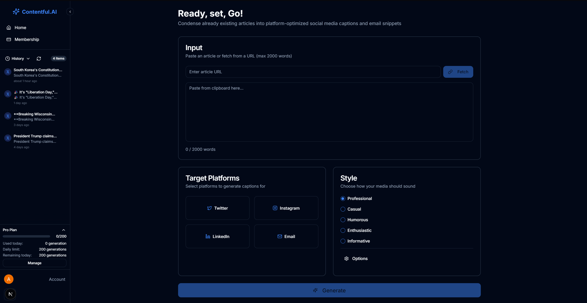

# Content Repurposing Tool

A powerful AI-driven application that transforms long-form content into platform-optimized social media posts and email snippets.



## Overview

The Content Repurposing Tool helps content creators, marketers, and businesses maximize their content reach by automatically repurposing existing articles, blog posts, or any long-form content into tailored formats for different social media platforms and emails.

### Key Features

- **AI-Powered Content Transformation**: Utilizes OpenAI's GPT-4o and Anthropic's Claude AI models to intelligently repurpose content
- **Multi-Platform Support**: Generate optimized content for:
  - Twitter/X
  - Instagram
  - LinkedIn
  - Email
- **Customizable Tone Selection**: Choose from professional, casual, humorous, enthusiastic, or informative tones
- **URL Content Extraction**: Automatically fetch and process content from any web article URL
- **History Management**: Access and reuse previously generated content
- **Usage Tracking**: Monitor your content generation usage with subscription-based limits
- **Customizable Output**: Adjust character limits per platform and add custom instructions
- **Emoji Support**: Optionally include appropriate emojis based on selected tone
- **Dark/Light Mode**: User-friendly interface with theme support

## Technology Stack

- **Frontend**: Next.js, React, TailwindCSS, shadcn/ui
- **Authentication**: Clerk
- **Database**: Supabase (PostgreSQL)
- **AI Models**: 
  - OpenAI GPT-4o (for consistency and specific instructions)
  - Anthropic Claude Haiku (for fast, efficient content generation)
- **Payments**: Stripe

## Local Development Setup

### Prerequisites

- Node.js (v18 or later)
- pnpm (or npm/yarn)
- Supabase account
- Clerk account
- OpenAI API key
- Anthropic API key (optional)
- Stripe account (for subscription features)

### Environment Variables

Create a `.env.local` file in the root directory with the following variables:

```bash
# Base URLs
NEXT_PUBLIC_SITE_URL=http://localhost:3000

# Supabase
NEXT_PUBLIC_SUPABASE_URL=your_supabase_url
NEXT_PUBLIC_SUPABASE_ANON_KEY=your_supabase_anon_key
SUPABASE_SERVICE_ROLE_KEY=your_supabase_service_role_key

# Clerk Authentication
NEXT_PUBLIC_CLERK_PUBLISHABLE_KEY=your_clerk_publishable_key
CLERK_SECRET_KEY=your_clerk_secret_key
NEXT_PUBLIC_CLERK_SIGN_IN_URL=/sign-in
NEXT_PUBLIC_CLERK_SIGN_UP_URL=/sign-up
NEXT_PUBLIC_CLERK_AFTER_SIGN_IN_URL=/dashboard
NEXT_PUBLIC_CLERK_AFTER_SIGN_UP_URL=/dashboard

# OpenAI API
OPENAI_API_KEY=your_openai_api_key

# Anthropic API (optional)
ANTHROPIC_API_KEY=your_anthropic_api_key

# Stripe (for subscriptions)
NEXT_PUBLIC_STRIPE_PUBLISHABLE_KEY=your_stripe_publishable_key
STRIPE_SECRET_KEY=your_stripe_secret_key
STRIPE_WEBHOOK_SECRET=your_stripe_webhook_secret

# Default character limits
NEXT_PUBLIC_MAX_CHARACTER_LIMIT=6000
NEXT_PUBLIC_DEFAULT_LIMIT_TWITTER=500
NEXT_PUBLIC_DEFAULT_LIMIT_INSTAGRAM=2200
NEXT_PUBLIC_DEFAULT_LIMIT_LINKEDIN=3000
NEXT_PUBLIC_DEFAULT_LIMIT_EMAIL=300
```

### Installation and Setup

1. Clone the repository:
   ```bash
   git clone https://github.com/yourusername/content-repurposing-tool.git
   cd content-repurposing-tool
   ```

2. Install dependencies:
   ```bash
   pnpm install
   ```

3. Initialize the database:
   - Set up your Supabase project and update environment variables
   - Run the application first time to trigger database initialization or use:
   ```bash
   curl http://localhost:3000/api/db-init
   ```

4. Run the development server:
   ```bash
   pnpm dev
   ```

5. Open [http://localhost:3000](http://localhost:3000) in your browser.

## Database Schema

The application uses the following main tables:

- `subscription_tiers`: Defines available subscription plans and limits
- `users`: Stores user details with Clerk authentication IDs
- `subscriptions`: Tracks user subscriptions and their status
- `generations`: Logs content generation history with full content
- `daily_usage`: Tracks daily usage for rate limiting

## Usage

1. **Sign In/Sign Up**: Create an account or sign in using the provided authentication
2. **Enter Content**: Paste content directly or fetch from a URL
3. **Select Platforms**: Choose which platforms to generate for
4. **Style Options**: Select tone, emoji options, character limits, and model provider
5. **Generate**: Click the generate button to create optimized content
6. **View & Copy**: View generated content in tabs and copy to clipboard for use

## Contributing

Contributions are welcome! Please feel free to submit a Pull Request.

1. Fork the repository
2. Create a feature branch: `git checkout -b feature-name`
3. Commit your changes: `git commit -m 'Add some feature'`
4. Push to the branch: `git push origin feature-name`
5. Open a pull request

## License

This project is licensed under the MIT License - see the LICENSE file for details.